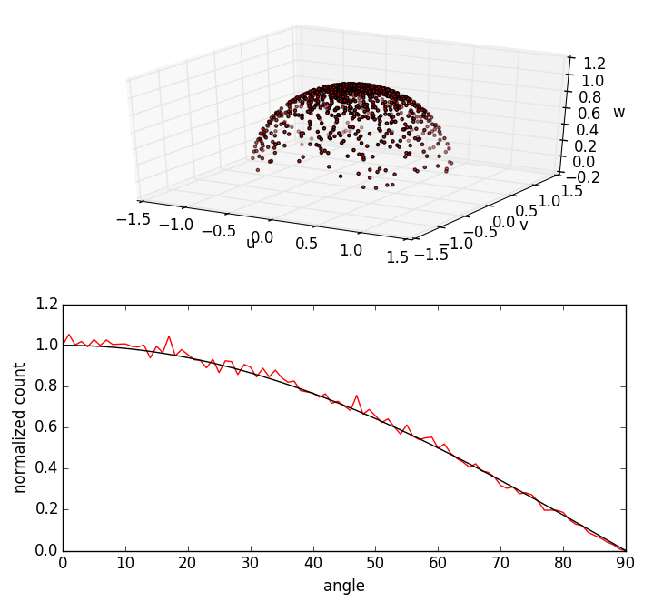

#Cosine (Lambertian) Sampling

Code demonstrating sampling of particles with initial direction following the cosine law off the surface normal

Visit https://www.particleincell.com/2015/cosine-distribution/ for more info
