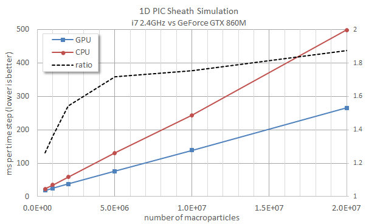

#CUDA PIC

Example of a PIC code using the graphics card (GPU) to push particles
https://www.particleincell.com/2016/cuda-pic/

The code was developed in about 2 hours without any optimization but still runs about twice as fast as the CPU version for a large number of particles
