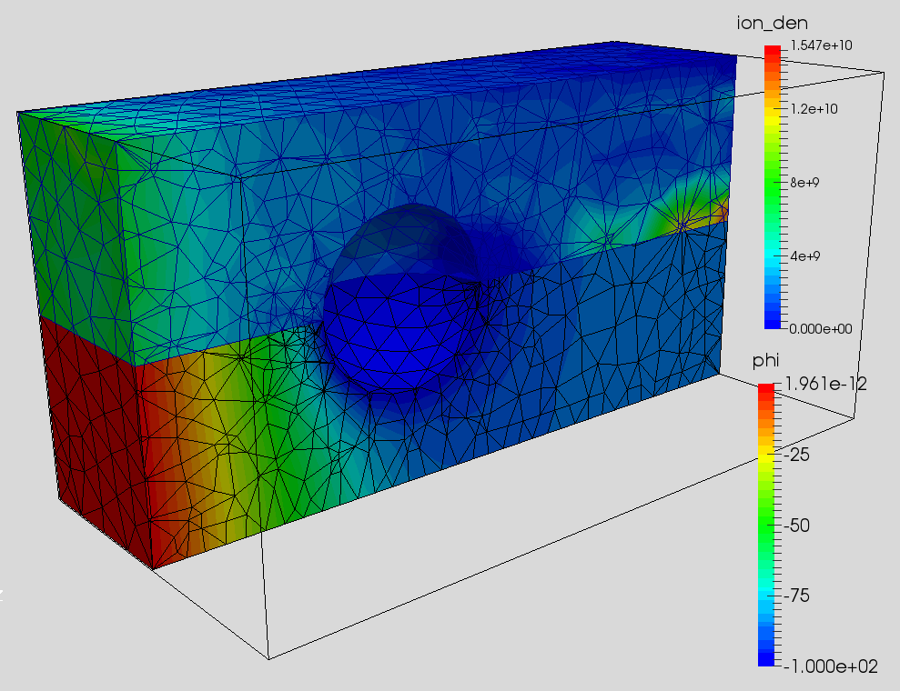

#Finite Element Particle In Cell (FEM-PIC)

Example of a Finite Element PIC code simulating flow of ions past a sphere on an unstructured mesh.
 
This code was originally developed for the [2015 Advanced PIC course](https://www.particleincell.com/advanced-pic/).
You will find more details at 
https://www.particleincell.com/2015/fem-pic/
but really the best way to learn how to write FEM-PIC codes is by taking the course. It will be offered again in 2016.

